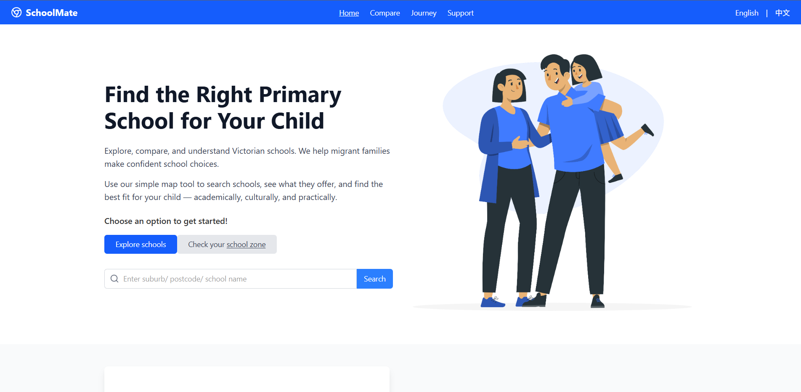
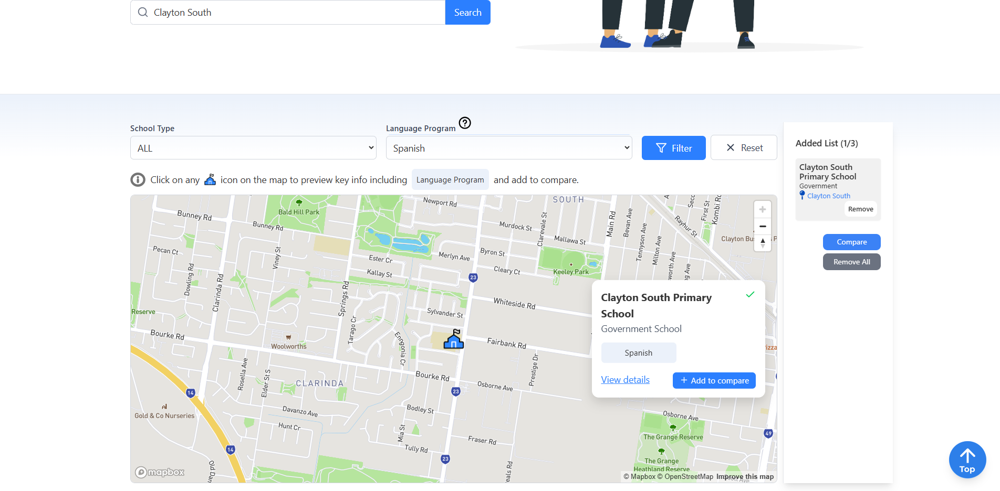
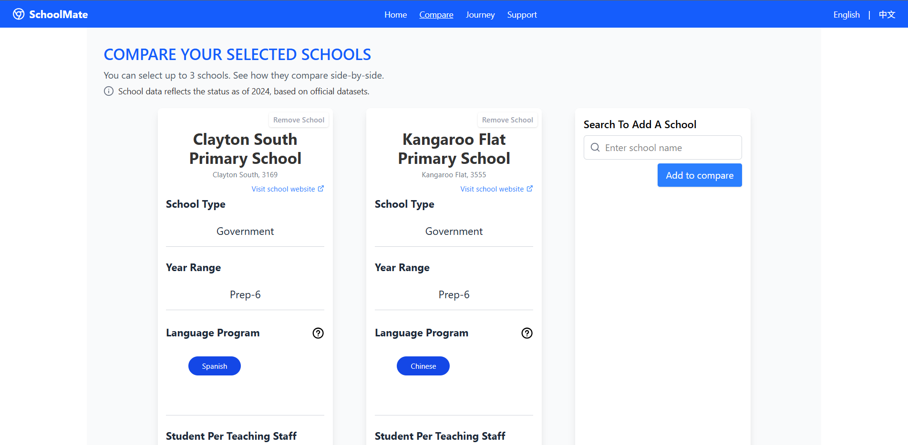
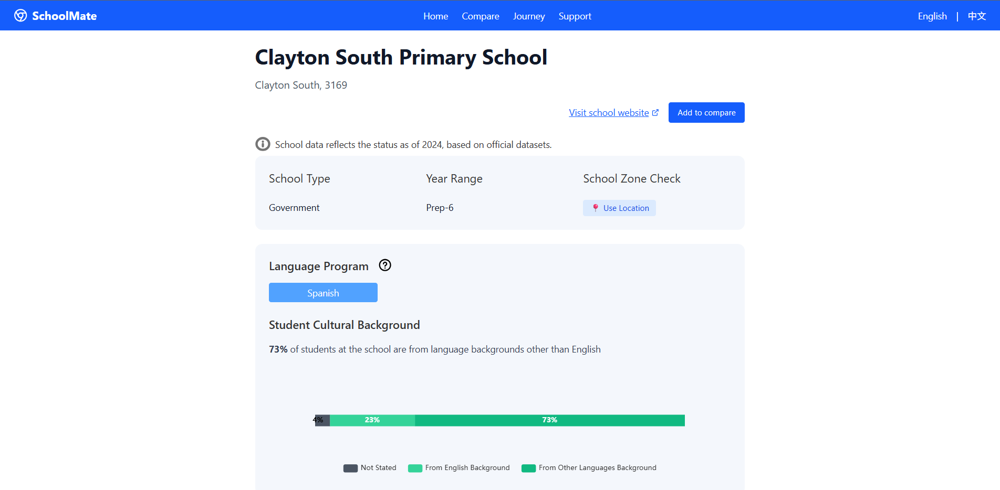
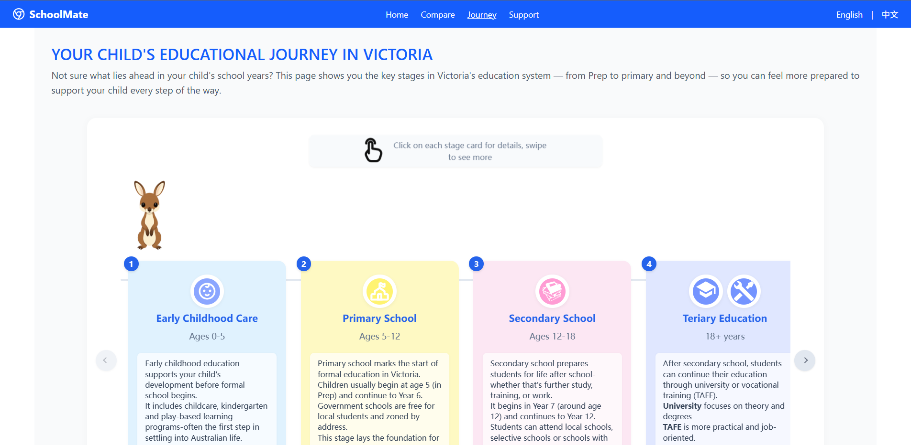
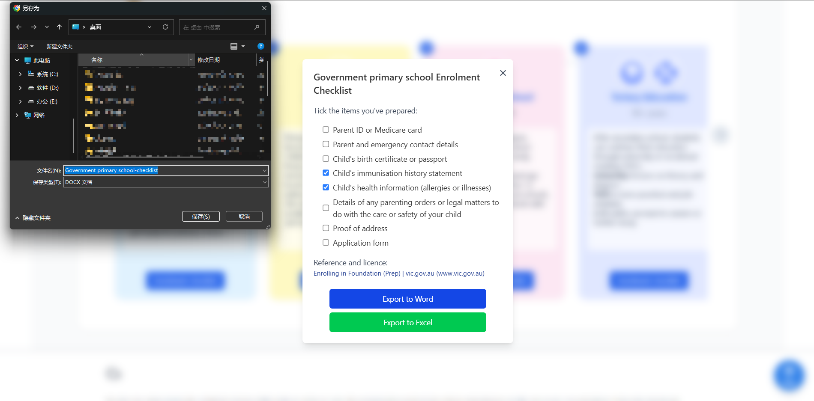
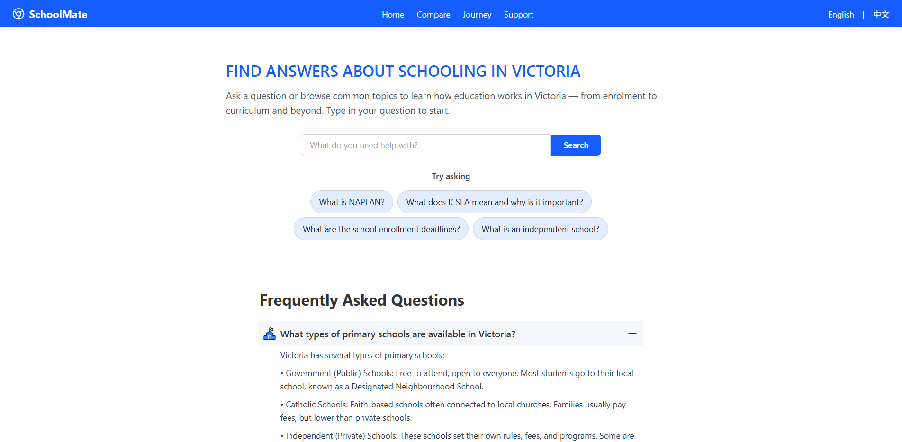
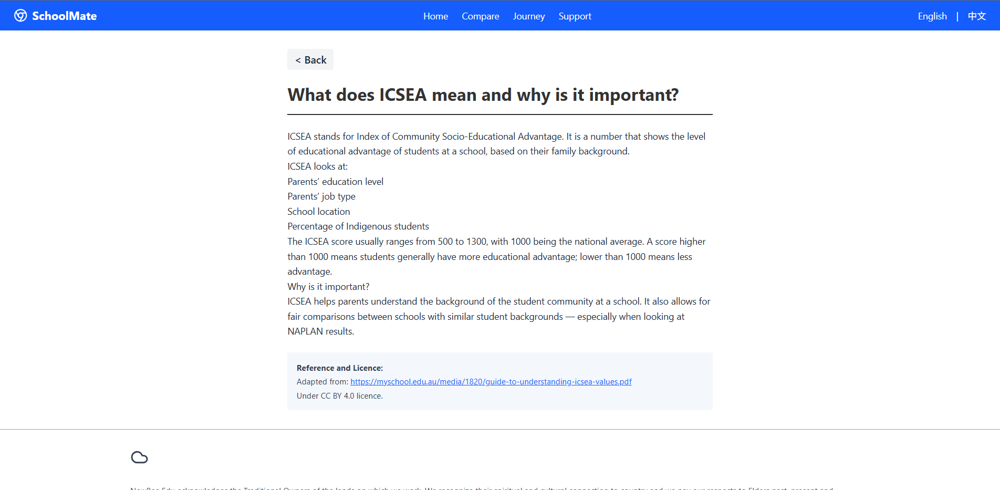

## 👥 Project Team
- **Team ID:** TP-21
- **Project Name:** SchoolMate – Your School Search Companion
- **Target Audience:** Migrant families in Victoria, Australia
- **Live Website:** https://schoolmatetp21.click/
- **Website Access**:
  - Username: `user`
  - Password: `tp21-newbee`
  
Our team is committed to building an intuitive platform that supports parents in navigating the local education system with confidence. The platform focuses on location-based school search, zone checking, comparison tools, and accessible bilingual information.

---
## 📘 Project Description
SchoolMate is an inclusive web application designed to support **migrant families in Victoria, Australia** with selecting and applying to primary schools. While Victoria offers a strong multicultural education system, many migrant parents face challenges such as fragmented information sources, language barriers, and unfamiliar school processes.
SchoolMate simplifies this experience by bringing together essential educational information — including school zones, enrolment procedures, and education pathways — into one accessible, bilingual platform.
##### 👨‍👩‍👧 Target Users
Our primary users are **migrant parents with primary-school-aged children** who:
- Are unfamiliar with the Victorian school system
- Encounter **language or cultural barriers**
- Seek **clear, trustworthy** information on enrolment, zoning, and education pathways
- Want their children to maintain connections with their cultural heritage
##### 🎯 Project Goals
- Reduce confusion and stress in school selection and enrolment
- Promote **equitable access** to education for culturally and linguistically diverse communities
- Support **informed, confident decision-making** through culturally appropriate and multilingual content
- Strengthen families’ sense of **control, inclusion, and belonging**
  
## 🚀 Project Features
This web application is designed to support migrant families in Victoria, Australia in selecting primary schools through interactive tools, comparison dashboards, and informative guidance. Below are the main features of the platform:
##### 🏠 Home Page
- Explore government and non-government primary schools on an interactive map.
- Search by school name or address to locate specific schools or determine catchment zones.
- Check if an entered residential address falls within a school zone using Mapbox and Google APIs.
- Add schools directly to the comparison dashboard by clicking map icons.
- Offers bilingual interface (Mandarin / English) for accessibility.
##### 📊 Compare Page
- Compare up to three schools side-by-side using both numerical indicators and visual charts.
- View key school metrics including:
  - Total enrolments
  - Language background
  - ICSEA score
  - Staff-student ratio
- Ability to remove and re-add schools dynamically, with-session-based storage to preserve state.
##### 📚 Resource Page
- Will provide curated resources for migrant parents on topics such as:
  - Understanding the Victorian education system
  - Translation help
  - Application assistance and government services
- Categorized and multilingual resource list with links to trusted sources.
##### ❓ Support Page
- Will feature a searchable Q&A module to address frequently asked questions.
- Questions grouped by educational stage (e.g., Prep, Primary, Secondary).
- Answers will include:
  - Clear bilingual explanations
  - Visual indicators for key terms (ICSEA, NAPLAN, etc.)
  - Source references and licensing details
##### 🏫 School Detail Page
- Displays detailed information about a selected school:
  - School name, type, suburb, enrolment numbers
  - Programs offered (e.g., language immersion)
  - Charts visualizing student background and staff ratios
- Links to add/remove the school from the comparison list
- Entry point from either the map or comparison view
---

## 🖼️ Screenshots
Below are example screenshots of key pages in **SchoolMate** that demonstrate its main features and user experience.
##### 🏠 Home Page – School Map and Zone Detection  
Users can search for schools or addresses and view the zoning area on an interactive map.




---
##### 📊 Compare Page – Side-by-Side Comparison  
Users can compare up to three schools simultaneously by viewing key statistics and visual charts.


---
##### 🏫 School Detail Page  
Detailed view of a single school, including ICSEA score, enrolment data, and charts.


---
##### 🧭 Education Journey Map  
Interactive timeline showing major education stages: Early Childhood, Primary, Secondary, Tertiary.


---
##### 📋 Enrolment Checklist  
Step-by-step checklist for school enrolment, including downloadable documents and status tracking.


---
##### ❓ Support Page – Q&A Module  
Searchable FAQ interface with answers grouped by education stage (e.g., Prep, Primary, Secondary).




---

## 🛠️ Project Technologies
SchoolMate is a full-stack web application built with modern web technologies, deployed on a cloud-based infrastructure to ensure performance, scalability, and maintainability.
##### 🌐 Frontend
**Framework**: Vue.js 3  
**Build Tool**: Vite  
**Styling**: Tailwind CSS   
**Routing**: Vue Router  
**Internationalization**: vue-i18n  

**Other Utilities**:  
- `axios` for HTTP requests  
- `lodash.debounce` for optimized input  
- `mapbox-gl` for map rendering  
- `docxtemplater`, `exceljs`, `file-saver` for file export  

**Build Modes**:  
Multiple build modes (`build:iter1`, `build:iter2`, `build:iter3`) are configured via `vite.config.js` to support feature isolation per iteration.

##### 🔧 Backend
**Language**: Python 3.9+  
**Framework**: Flask  
**Routing and API**: RESTful structure using Flask Blueprints  
**CORS Support**: via `flask-cors`  
**Database Layer**: SQLAlchemy ORM  
**Database Migration**: Flask-Migrate  

**API Structure**:  
- APIs are modularized in `/routes.py`  
- Google Proxy Endpoints for autocomplete and geocode  
- `/articles` endpoint with text search capability  

##### 🗄️ Database
**Database Engine**: MariaDB (MySQL-compatible)  
**ORM Tool**: SQLAlchemy  
**Deployment**: AWS EC2
  

---
## 👉 Project Building process
This project follows an Agile development methodology and was executed over three iterations.
- Each version is associated with a feature-complete milestone based on team-defined Epics and User Stories. Development branches for each iteration can be found here:
  - Iteration 1: [iteration1-dev](https://github.com/StevenT899/tp21-main/tree/iteration1-dev)
  - Iteration 2: [iteration2-dev](https://github.com/StevenT899/tp21-main/tree/iteration2-dev)
  - Iteration 3: [iteration3-dev](https://github.com/StevenT899/tp21-main/tree/iteration3-dev)
  
##### 📦 Releases
- [v1.0 – Iteration 1](https://github.com/StevenT899/tp21-main/releases/tag/v1.0)
- [v2.0 – Iteration 2](https://github.com/StevenT899/tp21-main/releases/tag/v2.0)
- [v3.0 – Iteration 3](https://github.com/StevenT899/tp21-main/releases/tag/v3.0)

##### 📝 Change Log
| Version | Branch Name       | Release Date | Key Features / Changes |
|---------|-------------------|--------------|--------------------------|
| v1.0    | `iteration1-dev`  | 2025-03      | Home page, map search, basic comparison |
| v2.0    | `iteration2-dev`  | 2025-04      | Address-based school zone check, sidebar, school detail page |
| v3.0    | `iteration3-dev`  | 2025-05      | Journey map, bilingual checklist, Q&A article formatting |

##### 💻 Development Members & Roles  
| Name                | Role                  | Responsibility Summary  |  
|---------------------|-----------------------|-------------------------|
| YuHan Chen (MIT)    | Full Stack Developer  | schools/school zones, journey map checklist, Flask APIs, interface pytest|  
| XinWen Tan (MIT)    | Full Stack Developer  | school comparison, Flask APIs, school detail, Q&A module |  


---
## ⚙️ Project Support

##### Recommended IDE Setup
[VSCode](https://code.visualstudio.com/) + [Volar](https://marketplace.visualstudio.com/items?itemName=Vue.volar) (and disable Vetur).
##### Customize configuration
See [Vite Configuration Reference](https://vite.dev/config/).

##### 📦 Prerequisites

- **Node.js** ≥ 18.x — for building the Vue 3 frontend  
- **Python** ≥ 3.9 — for running the Flask backend  
- **MariaDB / MySQL** — relational database used by the backend  
- **Mapbox Access Token** — for map rendering  
- **Google Maps API Key** — for autocomplete and geocoding


##### 📁 Project File Structure
```
TP21-MAIN
├── backend
│   └── app
│       ├── __init__.py
│       ├── config.py
│       ├── dao.py
│       ├── extensions.py
│       ├── models.py
│       └── routes.py
│   ├── migrations
│   ├── config.ini
│   ├── requirements.txt
│   └── run.py
├── frontend
│   └── tp21-main
│       ├──.vscode
│       ├── dist
│       ├── node_modules
│       ├── public
│       ├── src
│       │   ├── assets
│       │   ├── components
│       │   ├── locales
│       │   ├── router
│       │   ├── utils
│       │   └── views
│       │       ├── findSchool
│       │       ├── JourneyMap
│       │       ├── QASupport
│       │       ├── HomeView.vue
│       │       ├── LoginView.vue
│       │       └── App.vue
│       ├── auth.js
│       ├── main.js
│       ├──.editorconfig
│       ├──.env.development
│       ├──.env.iter1
│       ├──.env.iter2
│       ├──.env.iter3
│       ├──.env.production
│       ├── eslint.config.js
│       ├── index.html
│       ├── jsconfig.json
│       ├── package-lock.json
│       ├── package.json
│       └── vite.config.js
├── tests
│   └── api
│       ├── __pycache__
│       ├──.gitignore
│       ├── conftest.py
│       ├── test_articles.py
│       ├── test_auth.py
│       ├── test_proxy.py
│       ├── test_schools.py
│   ├── pytest.ini
│   └── test_report.html
├──.env
└── README.md
```
##### 🔐 Environment & API Keys

To run this project locally, make sure to configure the following environment variables.

##### 📁 `frontend/.env.development`
Create a file named `.env.development` inside the `frontend/tp21-main/` directory with the following content:

```env
VITE_API_URL="http://127.0.0.1:5000"                 # Proxy to backend Flask API
VITE_MAPBOX_TOKEN=your_mapbox_token_here
```
##### 📁 `TP21-MAIN/.env`
In the `TP21-MAIN/`, create a file named `.env` and add:

```bash
[google]
GOOGLE_API_KEY = your_google_api_key_here

[mysql]
MYSQL_HOST = your_mysql_host
MYSQL_USER = your_mysql_user
MYSQL_PASSWORD = your_mysql_password
MYSQL_DATABASE = your_database_name

[auth]
LOGIN_USERNAME = your_login_username
LOGIN_PASSWORD = your_login_password

[app]
url_prefix = /api
```
##### 🚀 Frontend Setup
```bash
cd frontend/tp21-main
npm install
npm run dev   # or: npm run build
```
##### 🔧 Backend Setup
```bash
cd backend
python3 -m venv venv
source venv/bin/activate  # Windows: venv\Scripts\activate
pip install -r requirements.txt
flask run
```

##### 🌍 Third-Party API Integration
This project integrates several third-party APIs and services to support core functionalities such as mapping, address search, and zone checking.
- **🗺️ Mapbox API**  
  - **Features**: Map rendering using vector tiles and static images, custom styles, interactive markers  
  - **Use Cases**:  
    - Displaying government primary schools on a dynamic map  
    - Visualizing school zones and user-selected areas  
    - Highlighting added schools with visual feedback  

- **📍 Google Places API**  
  - **Features**: Autocomplete suggestions, place detail metadata (e.g., name, address, coordinates)  
  - **Use Cases**:  
    - Suggesting valid locations in Victoria while typing  
    - Enabling location-aware school search  

- **📌 Google Geocoding API**  
  - **Features**:  
    - Forward Geocoding (address → coordinates)  
    - Reverse Geocoding (coordinates → address)  
  - **Use Cases**:  
    - Determining school eligibility based on entered residential addresses  
    - Translating map clicks or GPS-based user location into readable addresses  

> 🔐 **Security Note**:  
> All API credentials (tokens and keys) are stored securely in `.env` or `config.ini` files and **never hard-coded**. This practice improves maintainability and prevents accidental credential exposure in public repositories.

##### ✅ Running Backend Tests
To run backend unit tests and generate an HTML report:
```bash
cd tests
pytest
```
This will execute all test files under tests/api/ and automatically generate a standalone HTML report (test_report.html) if pytest.ini is properly configured.
> ℹ️ Make sure you have all dependencies installed:
> ```bash
> pip install -r../backend/requirements.txt
> ```
**Example output:**

- `tests/test_report.html` — Viewable in browser, includes pass/fail breakdown and details.

##### 📄 License
This project is licensed under the [MIT License](https://opensource.org/licenses/MIT).

---

### 📬 Contact

We welcome questions, feedback, or suggestions to improve **SchoolMate**.
💻 **GitHub**: [Xinwen Tan](https://github.com/StevenT899),    [Yuhan Chen](https://github.com/ReviveDesire)

